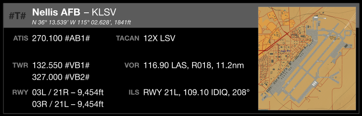

# Template Elements

To support kneeboard construction, KBB includes number of *elements* templates that can be used
to replace content on a kneeboard using
[replacement edits](../README.md#specifying-edits).
By convention, the file names for these templates start with `Elems_`. Elements templates enable customization beyond simply changing the content of a field in a form.

To allow flexibility and interchangability, an element is a multiple of 50px high and has a
width of *W*, *W*/2, or *W*/3 where *W* is the width of the kneeboard, 1440px. Typically, these elements are used with the
[`KBT_Grid_Card.svg`](../templates/KBT_Grid_Card.svg)
template. Elements also support substitution via `#tag;plist#` constructs (see the template builder
[documentation](Tmplt_Builder_Guide.md)
for additional details).

The remainder of this document covers the available elements and how they can be used to build
out a kneeboard.

## `Elems_Bases_*.svg`: Airbase Information Blocks

An *Airbase Information Block* element provides key data on an airbase such as frequencies,
NAVAIDs, and runways. The `.svg` element for a block uses the ICAO abbreviation as the element
ID, is always *W* by 450px, and may be customized using `#tag;plist#` substitutions.

For example, this is the information element for Nellis AFB from
`Elems_Bases_NTTR.svg`,

The elemnt ID for an airbase information block is the ICAO abbreviation for the base. The
blocks are grouped into per-theater files. Currently supported theaters and bases include,

| Element Template File     | Theater  | ICAO | Airbase Name |
|---------------------------|:--------:|:----:|--------------|
|`Elems_Bases_Kola.svg`     | Kola     | ENNA | Banak
|                           |          | ENBO | Bodo
|                           |          | EFRO | Rovaniemi
|`Elems_Bases_NTTR.svg`     | NTTR     | KINS | Indian Springs (Creech) Air Force Base
|                           |          | KLSV | Nellis Air Force Base
|                           |          | KTNX | Tonopah Test Range
|`Elems_Bases_Marianas.svg` | Marianas | PGUA | Andersen Air Force Base
|`Elems_Bases_Syria.svg`    | Syria    | LLBG | Ben Gurion

As mentioned earlier, the ICAO abbreviation is used to identify a specific
information block within the element template file.

All information blocks have several fields that may be customized through edits to the element
as
[described here](TODO_LINK#specifying-edits).
Generally, updating these fields uses the "`id`&nbsp;:&nbsp;`tag`" or ":&nbsp;`tag`" forms.

|Field  |Description|
|:-----:|-----------|
| `T`   | Two-character airbase "type"; for example, "PR" for primary, "A1" for alternate #1
| `AB1` | Optional preset button for ATIS frequency #1
| `AB2` | Optional preset button for ATIS frequency #2
| `TB1` | Optional preset button for tower frequency #1
| `TB2` | Optional preset button for tower frequency #2

TODO

## `Elems_Grid.svg`: General Grid Elements

TODO

### Section Headers and Dividers

TODO

### Section Header Column Headings

TODO

### Basic Rows

TODO

### Row Cells

TODO

|Element ID|Description|
|:--------:|-----------|
|Cell Title W1 L1 | Full-width, 1-line cell with small title
|Cell Title W2 L1 | Half-width, 1-line cell with small title
|Cell Title W1 L2 | Full-width, 2-line cell with small title
|Cell Title W2 L2 | Half-width, 2-line cell with small title
|Cell Title W1 L3 | Full-width, 3-line cell with small title
|Cell Title W1 L4 | Full-width, 4-line cell with small title
|Cell Title W1 L6 | Full-width, 6-line cell with small title
|Cell Title W1 L8 | Full-width, 8-line cell with small title

TODO