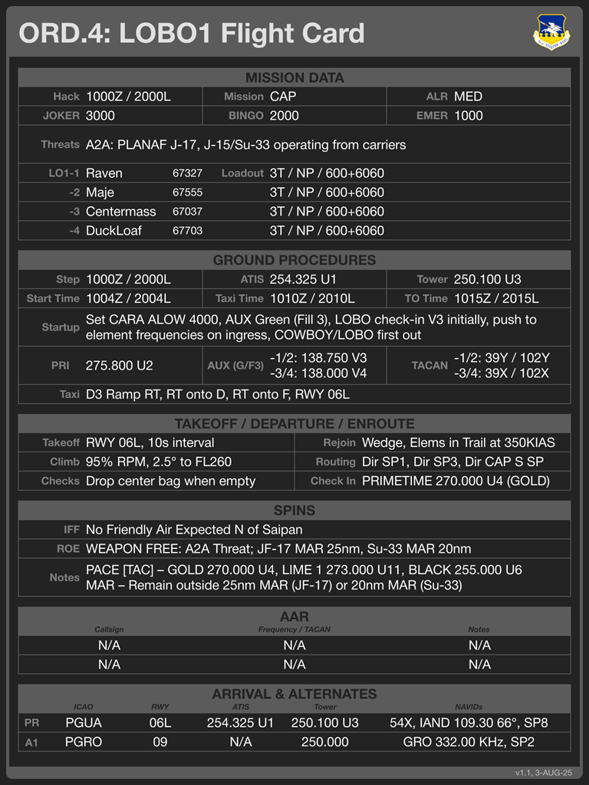

# `KBT_Flight_Card`: Flight Information Card

The `KBT_Flight_Card.svg` template defines a kneeboard that contains basic flight information
for a flight including details like roster, loadouts, AAR, relevant airbases. This template
generates kneeboards that look like this,

The structure of this kneeboard is fixed (that is, there is always a "Hack" field at the top
of the kneeboard, an "Arrivals & Alternates" table at the bottom, etc) but the specific
information may be changed through the description file.

## Overview

This template is made up of six sections (*Mission Data*, *Ground Procedures*, 
*Takeoff / Departure / Enroute*, *SPINS*, *AAR*, and *Arrival & Alternates*) that each carry
summary information on different phases of a mission (departure, enroute, etc.) or important
frequencies and details. Each section holds multiple fields that may be set by the description
file. All content on this kneeboard is optional and any field may be empty as desired.

> While a given field may not be filled in, you cannot remove unused fields from the kneeboard
> and replace them with other content.

## Descriptions

This template uses `tag` | `text`
[substitution edits](../README.md#specifying-edits)
to specify the content for the kneeboard. An `.xlsx` description file that generates the sample
kneeboard shown above is located
[here](sdefs/sdef_kbt_flight_card_example.xlsx)
and a `.csv` version is available
[here](sdefs/sdef_kbt_flight_card_example.csv).
Either may be useful as a starting point for your own kneeboards.

> For correct operation, do **not** change field names in Column B.

### Basic Fields

The `KBT_Flight_Card.svg` template supports the
[common kneebarod fields](../README.md#common-fields)
including *KBB Template*, *KBB Output*, *Card Title*, and *Card Version*, and *Card Tinted* .

### Mission Data Section

The *Mission Data* section supplies overview information on the mission and has the following
fields,

|Field|Description|
|:---:|-----------|
|<code>Hack                </code>| Hack time for mission
|<code>Mission&nbsp;Type   </code>| Mission type; for example, "SEAD", "BARCAP", "Strike".
|<code>ALR                 </code>| Acceptable level of risk for mission; for example, "Extreme", "Low"
|<code>Fuel&nbsp;JOKER     </code>| JOKER fuel level
|<code>Fuel&nbsp;BINGO     </code>| BINGO fuel level
|<code>Fuel&nbsp;EMER      </code>| Emergency fuel level
|<code>Threats             </code>| Threat information. Two lines are available, line breaks in the field value specify where lines are broken when building the output
|<code>FL                  </code>| Flight abbreviation, typically first and lest letter of name plus the flight number. For example, PYTHON2 would use "PN2" for this field
|<code>Pilot&nbsp;***N***  </code>| Pilot callsign for position *N* in the flight
|<code>T&nbsp;***N***      </code>| Five-digit tag for position *N* in the flight; for example, a TNDL value in the VIPER
|<code>Loadout&nbsp;***N***</code>| Loadout information for position *N* in the flight

Here, <code>***N***</code> is the position number within the flight and is either "1", "2", "3", or "4".

### Ground Procedures Section

The *Ground Procedures* section supplies information on ground operations pre- and post-flight.
This section has the following fields,

|Field|Description|
|:---:|-----------|
|<code>Step&nbsp;Time      </code>| Step time
|<code>COMM&nbsp;ATIS      </code>| ATIS frequency at departure airport
|<code>COMM&nbsp;TWR       </code>| Tower frequency at departure airport
|<code>Start Time          </code>| Start-up time
|<code>Taxi Time           </code>| Taxi time
|<code>TO Time             </code>| Take-off time
|<code>Startup             </code>| Startup instructions. Two lines are available, line breaks in the field value s<code>pecify where lines a</code>re broken when building the output.
|<code>C1L                 </code>| Label for COMM1
|<code>COMM&nbsp;C1 | Initi</code>al COMM1 communications frequency. Two lines are available, line breaks in the f<code>ield value specify w</code>here lines are broken when building the output
|<code>C2L                 </code>| Label for COMM2
|<code>COMM&nbsp;C2 | Initi</code>al COMM2 communications frequency. Two lines are available, line breaks in the f<code>ield value specify w</code>here lines are broken when building the output
|<code>TACAN&nbsp;Flight   </code>| TACAN to use for flight yardstick
|<code>Ground&nbsp;Taxi    </code>| Ground taxi instructions from parking to departure runway

### Takeoff / Departure / Enroute Section

The *Takeoff / Departure / Enroute* section supplies information on getting to and from the
AO. This section has the following fields,

|Field|Description|
|:---:|-----------|
|<code>Enroute&nbsp;Takeoff      </code>| Take off instructions, runway, etc.
|<code>Enroute&nbsp;Rejoin       </code>| Rejoin instructions for forming up post departure
|<code>Enroute&nbsp;Climb        </code>| Climb instructions for enroute portion of mission
|<code>Enroute&nbsp;Routing      </code>| Routing instructions from departure point to AO
|<code>Enroute&nbsp;Checks       </code>| System check reminders for the enroute portion of the flight
|<code>Enroute&nbsp;Check&nbsp;In</code>| Frequencies and agencies for check-in following departure during enroute

### SPINS Section

The *SPINS* section summarizes information on special instructions for the mission. This
section has the following fields,

|Field|Description|
|:---:|-----------|
|<code>SPINS&nbsp;IFF      </code>| Summary of IFF requriements
|<code>SPINS&nbsp;ROE      </code>| Summary of rules of engagement
|<code>SPINS&nbsp;Notes    </code>| General notes. Two lines are available, line breaks in the field value specify where lines are broken when building the output

### AAR Section

The *AAR* section supplies information on tankers available for air-to-air refueling. The
kneeboard has space for up to two AAR flights. This section has the following fields,

|Field|Description|
|:---:|-----------|
|<code> AAR ***N*** Flight   </code>| Callsign for AAR flight *N*
|<code> AAR ***N*** FRQ TACAN</code>| Frequency and TACAN information for AAR flight *N*
|<code> AAR ***N*** Notes    </code>| Notes on AAR flight *N* including altitude, track, etc.

Here, <code>***N***</code> is the AAR number and is either "1" or "2".

### Arrival & Alternatives Section

The *Arrival & Alternatives* section supplies information on arrival and alternate airbases
for the mission. The kneeboard has space for a primary and an alternate airbase. This section
has the following fields,

|Field|Description|
|:---:|-----------|
|<code>***X*** I      </code>| Airbase ICAO code for airbase *X*
|<code>***X*** R      </code>| Active runway for airbase *X*
|<code>***X*** A      </code>| ATIS frequency for airbase *X*
|<code>***X*** T      </code>| Tower frequency for airbase *X*
|<code>***X*** NAVAIDS</code>| NAVAIDS (VORTAC, TACAN, ILS, etc.) for airbase *X*

Here, <code>***X***</code> specifies the base the data applies to and is either "P" (primary)
or "1" (alternate #1).
