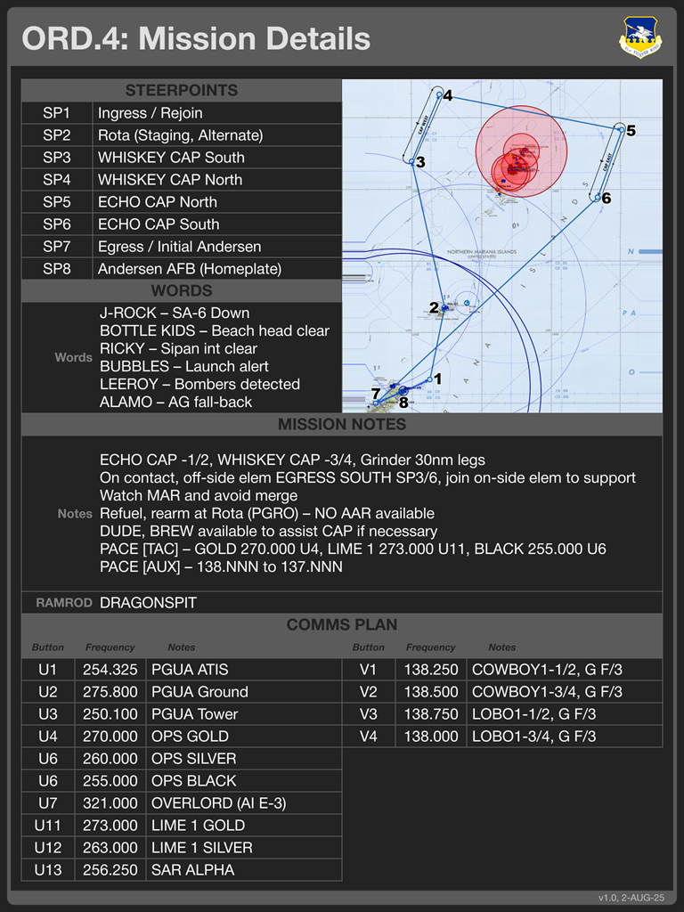

# `KBT_Grid_Card`: General "Grid-Based" Card

The `KBT_Grid_Card.svg` template supports a "grid-based" layout format that can support general
collections of images, tables, and so on. This generates a wide range of kneeboards that look
like this,

The content of this kneeboard is assembled from one or more *elements* as described in the
elements
[documentation](./Elements.md).

## Overview

This template provides a generic "grid" that can be filled in with interchangable elements that
allow you to construct tables of different formats, include images, present airbase
information, and so on. The elements
[documentation](./Elements.md)
describes the available elements in greater detail.

The "grid" on the grid card has 50px vertical spacing and 480px horizontal spacing. Horizontal
placement depends on the element. This is consistent with the setup for grid elements the
[elements documentaiton](./Elements.md)
describes.

## Elements

TODO

The sample description file for this kneeboard is
[here](sdefs/Description_Flight_Card.xlsx).

> For correct operation, do **not** change field names in Column B.

## Descriptions

TODO